# Qubic Watchlist Notification & Monitoring Service - Proposal

**Project Lead:** alez_nv
**Version:** 1.2 (update milestones and budget; clarify maintenance and payment plans)
**Last update**: 05/30/2025

## 1. Abstract

The Qubic Watchlist Notification & Monitoring Service is a lightweight, developer-centric tool designed to provide real-time on-chain activity monitoring for the Qubic ecosystem. Users will be able to track specific wallet addresses, smart contracts, and transaction patterns, receiving timely alerts via multiple channels including email, Telegram, and Discord. This service aims to enhance user experience, security, and developer efficiency by offering actionable insights and automation capabilities. It directly complements Qubic’s existing infrastructure and integration-first strategy.

## 2. Introduction and Motivation

As the Qubic ecosystem expands, the need for accessible and real-time monitoring tools becomes paramount. Developers and users require immediate notifications about significant on-chain events to manage assets, debug applications, and ensure security. Currently, tracking such events can be cumbersome, often requiring custom scripts or constant manual checks.

The Qubic Watchlist Service addresses this gap by:

- **Reducing friction:** Simplifying how developers and users interact with Qubic Bridges, Qubex, and various dApps.
- **Enhancing security:** Providing timely alerts for potentially suspicious activities or critical transactions.
- **Improving efficiency:** Automating the monitoring process, freeing up valuable time for users and developers.
- **Supporting integration:** Aligning with Qubic’s integration-first strategy by providing robust API access and leveraging existing tools like QubiPy, QubicJ, and QubicMetrics with minimal new infrastructure.

This service is envisioned as an official developer tool within the Qubic ecosystem, adding immediate value through increased visibility and automation.

## 3. Key Features

The Qubic Watchlist Service will offer the following core functionalities:

- **Real-Time Notifications:**
  - Alerts for balance changes on monitored wallet addresses.
  - Notifications for incoming and outgoing transactions.
  - Support for custom smart contract event monitoring (e.g., specific function calls, state changes).
- **User Watchlists:**
  - A simple, intuitive User Interface (UI) for users to add, manage, and remove wallet addresses or smart contracts they wish to monitor.
  - Filtering and search capabilities within watchlists.
  - Local state persistence for user preferences and watchlist configurations.
- **Multi-Channel Alerts:**
  - Configurable alert delivery via:
    - Email
    - Telegram
    - Discord (via webhooks)
    - (Future potential for Slack and other platforms)
- **API Access:**
  - Public REST endpoints allowing dApps, scripts, or third-party services to programmatically interact with the watchlist service.
  - Endpoints for adding/removing monitored items, configuring alerts, and potentially querying alert history.
- **Historical Dashboards (Basic):**
  - Simple analytics widgets displaying key metrics for monitored items, such as:
    - Transaction frequency.
    - Average transaction fees (if applicable and retrievable).
    - Network/service uptime indicators.
  - Powered by integration with QubicMetrics where feasible.

## 4. Technical Overview & Architecture

The service will be built with a modular architecture to ensure scalability and maintainability. The following diagram illustrates the high-level system architecture:

**Core Components:**

1.  **Backend Alert Engine:**
    - Responsible for polling the Qubic blockchain (potentially using QubiPy or an optimized alternative via the `Polling Engine`).
    - Manages an event queue to process blockchain data.
    - Contains the core logic for identifying and triggering alerts based on user-defined criteria.
    - Interacts with a `Database` to store watchlist configurations and user preferences.
2.  **Frontend UI:**
    - A React-based web interface for `User` interaction.
    - Allows users to manage their watchlists, configure notification channels, and view basic dashboards.
3.  **API Layer:**
    - A set of RESTful API endpoints for programmatic access by the `Frontend UI` and external `dApps/Third-Party Services`.
    - Handles authentication and request validation.
4.  **Notification Module:**
    - Integrates with third-party services (`Email Service`, `Telegram API`, `Discord Webhooks`) to dispatch alerts.
    - Includes logic for message formatting and rate-limiting to prevent abuse.

This modular design will facilitate independent development and scaling of each component.

## 5. Development Scope & Timeline

The project is estimated to take **8 weeks** with a dedicated team comprising one Full-Stack Engineer and one UI/UX Designer.

- **Total Estimated Budget:** €15,000
- **Implementation Timeline:** 8 weeks

**Key Deliverables:**

- A fully functional backend alert engine.
- A user-friendly frontend UI for watchlist management.
- Integrated notification channels (Email, Telegram, Discord).
- Public API for third-party integration.
- Basic historical dashboard widgets.
- Comprehensive API documentation and user guides.

## 6. Payment Milestones

The total budget of €15,000 will be disbursed based on the following milestones over the 8-week duration. The timeline is visualized in the Gantt chart below:

**Milestone Breakdown:**

1.  **Milestone 1 – Alert Engine Core – €3,000 (20%)**

    - **Timeline:** Weeks 1-2
    - **Activities:**
      - Development of the QubiPy-based (or alternative) polling engine.
      - Implementation of the event queue and internal alert processing logic.
      - Initial database schema design and implementation for watchlists.
      - Testnet integration with basic sample alerts.

2.  **Milestone 2 – Frontend Watchlist UI – €3,750 (25%)**

    - **Timeline:** Weeks 3–4
    - **Activities:**
      - Development of the React-based watchlist interface (add/remove addresses/contracts).
      - Implementation of UI components for managing notification preferences.
      - Client-side logic for filters and local state persistence.
      - Integration with backend APIs for watchlist management.

3.  **Milestone 3 – Notifications Integration – €3,750 (25%)**

    - **Timeline:** Week 5-6
    - **Activities:**
      - Integration with Email services.
      - Setup and integration of Telegram and Discord webhooks.
      - Implementation of notification formatting and content customization.
      - Development of rate-limiting mechanisms for notifications.
      - End-to-end alert testing and verification across all channels.

4.  **Final Milestone – Delivery & Documentation – €4,500 (30%)**
    - **Timeline:** Weeks 7-8
    - **Activities:**
      - Full system integration, rigorous testing (unit, integration, user acceptance).
      - Development and integration of basic dashboard widgets (optional, based on feasibility within the timeline).
      - Deployment to a staging/production environment.
      - Creation of comprehensive API documentation.
      - Preparation of user guides and tutorials.

## 7. Sustainability and Long-Term Vision

To ensure the long-term viability and continuous improvement of the Qubic Watchlist Service, several monetization and sustainability models are being considered:

- **Freemium Tiered Model:**

  - **Free Tier:** Basic alerting capabilities (e.g., limited to 5 watchlist items, email notifications only) available to all users. This encourages adoption and provides core value.
  - **Pro Tier:** Aimed at advanced users, developers, and teams. Offers an increased number of watchlist items, access to all notification channels (Telegram, Discord), higher alert priority, and potentially access to custom event tracking features.
  - **Premium Tier:** A white-label or API-focused tier for dApps, exchanges, or other projects within the Qubic ecosystem that wish to integrate the alert functionality directly into their own services, possibly with higher API rate limits and dedicated support.

- **Subscription Model (Paid in QUBIC):**

  - Users subscribe to various service tiers using QUBIC tokens, with options for monthly or annual plans.
  - This model directly contributes to the utility and demand for QUBIC tokens.
  - Potential integration with Qubex for seamless token swaps.
  - Possibility of offering discounts for users holding or staking QUBIC tokens, further incentivizing participation in the Qubic ecosystem.

- **Ecosystem Revenue Sharing / Grant-Based Sustenance:**

  - If the service becomes an official and integral Qubic ecosystem tool, a hybrid model could be explored.
  - Qubic Foundation/DAO could receive a share of subscription revenue.
  - Alternatively, ongoing operational and development costs could be subsidized through grants or an incubation stream, treating the service as public good infrastructure.

- **B2B Licensing / Custom Deployments:**
  - For large dApps, node operators, or enterprises requiring dedicated infrastructure, advanced webhook routing, private analytics dashboards, or specific compliance features.
  - This would involve custom deployment and licensing agreements, providing a tailored solution for high-demand clients.

The choice of model, or a combination thereof, will be further evaluated based on community feedback, adoption rates, and strategic alignment with the Qubic ecosystem's growth.

The service will be maintained and operated by Navia Tech (alez_nv’s team) after project delivery. Initially, a paid subscription plan will be implemented using Stripe for payment processing. Integration of QUBIC token payments is planned as a future enhancement, enabling seamless in-ecosystem transactions.

Revenue from subscriptions will support ongoing operations and development. No additional funding from the QES is expected after incubation, ensuring the project’s financial independence.

## 8. Team

The initial development will be carried out by a lean and experienced team:

- **alez_nv (Full-Stack Engineer)** is the founder and principal software architect behind Navia Tech. With a robust background in full-stack development, he spearheads the technical direction of the company.
- **alexandra_nv: UI/UX Designer:** Responsible for designing an intuitive and user-friendly interface, ensuring a seamless user experience.

## 9. Marketing and Communication Strategy

1. **Target Users**

   - Qubic developers, traders, and community admins.

2. **Main Messages**

   - Real-time alerts for wallets and contracts.
   - Easy to use and integrate.
   - Improves security and saves time.

3. **Before Launch**

   - Share updates and screenshots on Twitter and Discord.
   - Invite early testers and collect feedback.

4. **Launch**

   - Announce on Twitter, Discord, and Telegram.
   - Share a demo video or short guide.
   - Highlight API for developers.

5. **After Launch**

   - Post weekly tips and updates.
   - Feature user stories or integrations.
   - Provide support through Discord.

6. **Promotion Channels**

   - Twitter for announcements.
   - Discord for feedback and support.
   - Telegram for community engagement.
   - Blog for guides and updates.

7. **Growth Strategy**

   - Free tier to attract users.
   - Referral or staking-based discounts.
   - Contests to boost community interest.

8. **Success Metrics**
   - Number of users and watchlists created.
   - Feedback from community.
   - API usage by other projects.
   - Conversion to paid tiers.

## 10. Conclusion and Call to Action

The Qubic Watchlist Notification & Monitoring Service offers a significant enhancement to the Qubic ecosystem by providing crucial real-time monitoring capabilities. It is designed to be developer-friendly, user-centric, and highly integrable, aligning perfectly with Qubic's strategic goals.

With a clear development plan, a modest budget, and strong potential for future expansion and sustainability, this project promises immediate value in terms of visibility, security, and automation for all Qubic users and developers.

We are seeking approval and funding to commence this 8-week development cycle and deliver a valuable tool to the Qubic community. We are confident that the Qubic Watchlist Service will become an indispensable part of the Qubic developer toolkit.
